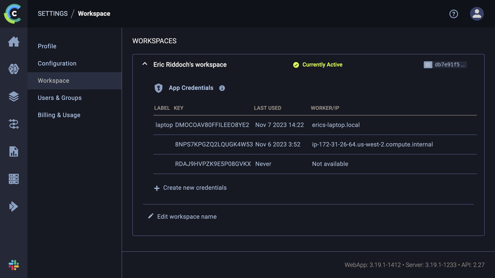
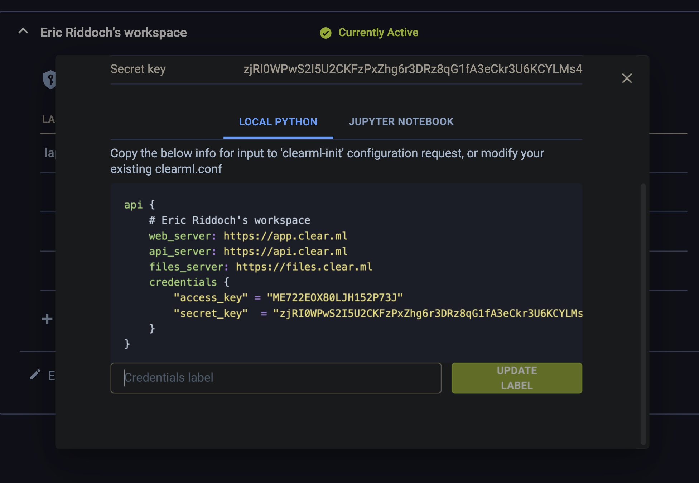
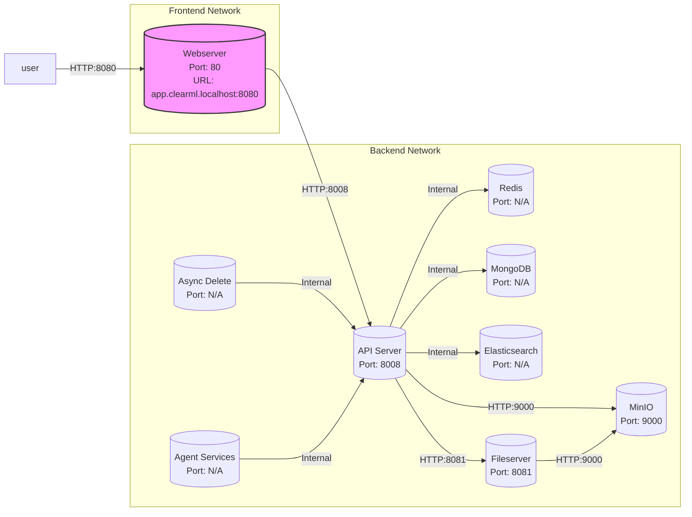

[](./LICENSE)

[](https://github.com/mlops-club/vscode-clearml-session-manager/actions/workflows/build-test-lint-publish.yaml)
[](https://codecov.io/gh/mlops-club/vscode-clearml-session-manager)

# `vscode-clearml-session-manager`

_The easiest way to connect to [ClearML Sessions](https://github.com/allegroai/clearml-session#readme)--one of the best remote workstation offerings in the MLOps space. (comparison of ClearML vs others [here](https://www.linkedin.com/posts/eric-riddoch_mlops-concept-i-am-obsessed-with-remote-activity-7115239643876380672-iRu1?utm_source=share&utm_medium=member_desktop))_

> 💬 We're looking for contributors! See the [contributing](#contributing) section below.

ClearML is self-hostable _without kubernetes_ and has a free SaaS-hosted plan, meaning you can get a world-class data science development environment for _free_.

## Watch and learn

- 2-minute [explainer video](https://share.descript.com/view/pjgR4yC04ai?transcript=false) of why DS should develop on remote workstations
- 60-second demo video of how it works, so far [here](https://share.descript.com/view/g0SLQTN6kAk)

[](https://share.descript.com/view/g0SLQTN6kAk)

## How this extension fits into a Cloud or on-prem Architecture


## Contributing

### Roadmap

> Items marked with ✨ are high-impact, and important for our first release

Features:

**Exploring sessions**

- [ ] Query the ClearML API to display the most useful data about each session
  - [ ] Total CPU cores
  - [ ] Public IP address of the worker
  - [ ] Private IP address of the worker
  - [ ] Total RAM
  - [ ] Queue name
  - [ ] Username/email of creator
  - [ ] Human-readable format of how long it's been alive, e.g. 1d 2h 5m
- [ ] Display a different-colored icon in the tree view, depending on whether the session is `queued`, `stopped`, `in_progress`, etc.
- [ ] Query the ClearML API for the the `clearml-session` args used to create the session including
  - [ ] `--queue default`
  - [ ] `--docker python3.9`
  - [ ] `--init-script` (the contents)
  - [ ] `--user`
  - [ ] `--password` (we should think about how to treat this)
- [ ] Create an intuitive means of displaying these ^^^

**Connecting to sessions**

- [x] ✨ Add support for connecting to existing ClearML Sessions
  - [x] ✨ Provide a way to collect the connection details (host, port, username, password)
  - [x] ✨ Provide a way to open the connection
- [ ] Add support for `settings.json` settings including
  - [x] `clearml-session-manager.clearmlConfigFilePath` (string), defaults to `~/clearml.conf`
    - [x] if `clearml-session-manager.clearmlConfigFilePath` is not set, and `~/clearml.conf` does not exist, prompt the user with instructions to start their own ClearML backend server and run `clearml-init`
  - [ ] `clearml.sessionPresets` (array of objects), lets you your favorite sets of arguments to the `clearml-session` CLI

> **Low priority** it may be of interest to support connecting to sessions by starting an "interactive session" via `clearml-session --attach <task id>` which creates an SSH tunnel to localhost. This is a different way of connecting to
> sessions, so this is redundant with the above.

- [ ] Start the `clearml-session` as a subprocess
  - [ ] Log the exact `clearml-session` command somewhere that the user can see (useful for debugging and learning)
  - [ ] Pop a message with a button allowing the user to follow along with the `clearml-session` logs
  - [ ] Parse the logs of the subprocess to detect
    - [ ] Failure: When the process is stuck in a retry loop because of SSH connectivity issues
      - [ ] React to failure by killing the subprocess (maybe after 3 retries) and alerting the user, offering to show them the logs
    - [ ] Success: Capture the connection host info, e.g. `ssh root@localhost -p 8022` and the password, e.g. `[password: pass]`
    - [ ] Success: the process hangs because the SSH tunnel has been left open
      - [ ] React to success by automatically opening a new VS Code window

**Creating sessions**

- [ ] Add a `+` button that allows you to create a ClearML session
  - [ ] Implement a way for users to define and select presets for `clearml-sessions`. Ideas:
    - [ ] Use something like `launch.json`, basically, have users define presets in a JSON file at `.vscode/clearml.json`
    - [ ] Have a UI form to collect user input for the `clearml-session` arguments, e.g. by using a `Webview`. Do API calls to provide the user with autocompletion on anything we can, e.g. for which queues are available

**DevOps**

- [x] ✨ Add a `docker-compose.yaml` and instructions for hosting ClearML locally for development. Here's their [official reference compose file](https://github.com/allegroai/clearml-server/blob/master/docker/docker-compose.yml).
- [ ] Add automated tests
  - [x] ✨ unit tests: establish pattern of unit tests, e.g. folder structure and example test
  - [ ] ✨ integration tests: establish pattern, e.g. run ClearML in CI via `docker-compose.yaml` and make API calls to it
- [ ] Suggestion from ClearML: shutdown idle instances. Determine which are idle by querying for the host metrics, e.g. CPU utilization.
- [ ] ✨ Add a CI pipeline
  - [ ] formatting, so all contributed code is uniform
  - [x] linting
  - [x] testing
  - [ ] tagging with the semantic version in `package.json`, pushing tags on merge
  - [ ] repo shields / badges
    - [ ] measure test code coverage and display as badge on repo
    - [ ] show build status, e.g. "failing"
    - [ ] change license to Apache 2.0, display as badge
- [ ] ✨ Add a CD pipeline
  - [x] learn how to publish a VS Code extension on the marketplace
  - [ ] [in progress] enable that for key maintainers to manually approve before the release goes out after each PR

### Running the extension locally

VS Code makes it really easy to run extensions and try out code changes:

1. be sure you have NodeJS installed, some had issues because they had the wrong Node version
2. go to the `src/extension.ts` file and press `F5` to start a debugging session

### Getting up to speed on ClearML and writing VS Code Extensions

Here are a few videos with progress updates. Watching these will step you through how we learned about authoring VS Code extensions and how we got to where we are now.

1. ~30 min - [Announcing the hackathon project](https://youtu.be/YddCUa-5yVI)
2. ~30 min - [How we got the extension to work with the Python interpreteer by forking the `vscode-black-formatter` extension](https://youtu.be/_FyadEJFRiM)
3. ~45 min - [Everything we created/learned during the all-nighter hackathon](https://youtu.be/fKTldHV_0Y0)
   - how to hit the ClearML API
   - how to read the `~/clearml.conf` file with TypeScript
   - how we decided to hit the ClearML API from TypeScript rather than Python
   - how we got the list items to show up in the sidebar
4. [Pull request](https://github.com/mlops-club/vscode-clearml-session-manager/pull/3): giving ClearML it's own "View Container" i.e. item
   in the leftmost sidebar. And how we got our icons to show up
   in all the right places.
5. ~5 min - [How we got VS Code to open a new window SSH'ed into an already-attached-to ClearML session](https://youtu.be/xmvlbjE0F1g)

### Running the extension and ClearML remotely

> 📌 **Note:** As a first contribution, it'd be great if you submitted a PR to this README if you get stuck during setup.

#### Step 1 - set up your own machine, i.e. your laptop

1. Sign up for the free, SaaS-hosted ClearML at app.clearml.ml
2. Follow the instructions in their UI to make a set of API keys and put them into a local `~/clearml.conf` file by running the `clearml-init` command and pasting them in.
   1. In case you mess up when doing the initialization, you can go to `Settings` > `Workspace` > `+ Create new credentials` in the UI to create a key pair. But it should automataically do this for you when you first log in. 
   2. 

#### Step 2 - set up a remote machine, e.g. a VM in the cloud

If you choose an EC2 instance or Amazon Lightsail (cheaper than EC2), you can
do something like this to install and start up the `clearml-agent daemon` which
will allow you to run ClearML Session on it:

First, connect to it via SSH

```bash
ssh ec2-user@<public ip of instance>
```

Then install and start the `clearml-agent daemon`

```bash
sudo su
yum update -y && yum install -y docker docker-compose python3-pip
service docker start

python -m pip install clearml clearml-agent
clearml-agent init  # paste in your API keys (you can also make a new pair for this)

# exapmle daemon command, you can set these however you like
clearml-agent daemon --queue default --docker --cpu-only --log-level debug
```

#### Step 3 - start a ClearML Session on your instance

On your laptop, you'd run something like

```bash
clearml-session --queue default --docker python:3.9
```

Note that this will open an SSH tunnel to your instance, so your instance needs
to accept incoming traffic on port `22` and probably others like `10022`.

If this is an EC2 instance, this means adjusting your security group. Other clouds
have a similar concept. They often call this a "firewall".

#### Step 4 - run the extension locally

Follow steps 1, 2, 3, and 6 below.

### Running the extension and ClearML completely locally

> ⚠️ **Disclaimer:** while getting this running locally is a good onboarding exercise,
> the last step currently fails (For Eric, at least) mid-way through creating the session.
> If you want to pursue troubleshooting this, by all means!
>
> Unfortunately, for the sake of continuing development, the most reliable course
> is to provision your own VM in the cloud e.g. an EC2 instance, Digital Ocean droplet,
> Linode server, etc.

> ⚠️ **Disclaimer:** expect problems if you try to run this project directly on Windows.
>
> Install the Windows Subsystem for Linux 2 (WSL2) and develop from there if
> you are running windows.
>
> The free videos in the [`Environment Setup` section of this
> course](https://www.udemy.com/course/setting-up-the-linux-terminal-for-software-development/) walk you through how to do this, as well as most of step [1] below.

1. install the prerequisites
   1. `docker`, on MacOS and Windows (including WSL2), get [Docker Desktop](https://www.docker.com/products/docker-desktop/)
   2. `docker-compose`, e.g. `brew install docker-compose`
   3. NodeJS, e.g. with `brew install nodejs`
   4. Python. `pyenv` is a good way to install Python.
   5. VS Code
2. clone the repo
3. install the NodeJS dependencies
   ```bash
   # cd into the cloned repo and install the NodeJS dependencies
   cd ./vscode-clearml-session-manager/
   npm install
   ```
4. generate a set of ClearML API keys, these get placed at `./dev-utils/volumes/opt/clearml/config/clearml.conf`
   ```bash
   npm run create-clearml-credentials
   ```
5. start the ClearML server
   ```bash
   npm run start-clearml-server
   ```
6. start the VS Code extension by opening `./src/extension.ts` and pressing `F5` on your keyboard
7. The extension should load successfully, but it won't have any sessions. To start a session, run

   ```bash
   # install the clearml-session CLI into a Python virtual environment
   python -m venv ./venv/
   source ./venv/bin/activate
   npm run install-python-deps

   # execute the clearml-session CLI to start a session
   npm run start-clearml-session
   ```

   This will take some time to run. While it loads, you should be able to visit
   http://localhost:8080 and visit the `DevOps` folder in Clearml after logging in
   with `username: test`, `password: test`.

## Architecture of ClearML

# ClearML Server with MinIO - Service Architecture



## Notes

| Service    | URL                                 | Notes                                 |
| ---------- | ----------------------------------- | ------------------------------------- |
| UI         | http://app.clearml.localhost:8080   | user: `test` pass `test`              |
| API Server | http://api.clearml.localhost:8008   |                                       |
| Fileserver | http://files.clearml.localhost:8081 |                                       |
| MinIO UI   | http://minio.clearml.localhost:9001 | user: `minioadmin` pass: `minioadmin` |

- **API Server (`apiserver`): `api.clearml.localhost:8008`** Interacts with MongoDB, Redis, Elasticsearch, Fileserver, and MinIO. It can be accessed internally by other services within the `backend_network`.
- **Webserver (`webserver`): `app.clearml.localhost:8080`** The main entry point for users in the browser. It can be visited at .
- **Fileserver (`fileserver`): `files.clearml.localhost:8081`** Serves files and communicates with MinIO on port `9000`. It's reachable internally by the API server at port `8081`.
- **MinIO (`minio`):** The file storage server replacing the built-in fileserver. It listens on port `9000` and can be accessed internally by both the Fileserver and the API server.
- **Elasticsearch (`elasticsearch`), MongoDB (`mongo`), and Redis (`redis`):** These services do not have ports exposed outside but can be accessed by the API server and other services within the `backend_network`.
- **Async Delete (`async_delete`):** It's an internal service that connects to the API server and depends on MongoDB, Redis, and Elasticsearch.
- **Agent Services (`agent_services`):** Interacts with the API server and does not expose any ports outside.

Ports mentioned as "N/A" are not directly exposed to the host machine but are used internally within the Docker network for service communication.

Remember to replace the example URL with the actual domain and port you will use in your production or development environment. The above diagram assumes that services like MongoDB, Redis, and Elasticsearch do not need to be accessed directly through a browser and therefore do not have a URL associated with them for external access.
