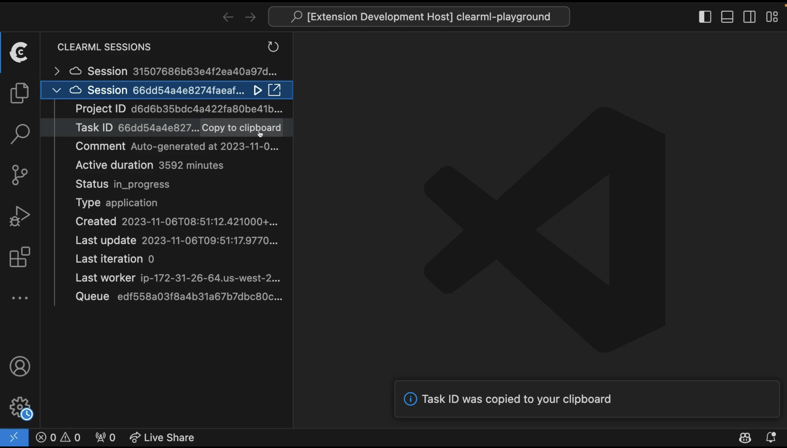

# `clearml-session-manager`

Demo video of how it works, so far [here](https://share.descript.com/view/g0SLQTN6kAk)

## Contributing

Here are a few videos with progress updates. Watching these will step you through how we learned about authoring VS Code extensions and how we got to where we are now.

1. ~30 min - [Announcing the hackathon project](https://share.descript.com/view/00uoQltZHWt)
2. ~30 min - [How we got the extension to work with the Python interpreteer by forking the `vscode-black-formatter` extension](https://share.descript.com/view/yH3tagRokS4)
3. ~45 min - [Everything we created/learned during the all-nighter hackathon](https://share.descript.com/view/DPuECWiE69B)
   - how to hit the ClearML API
   - how to read the `~/clearml.conf` file with TypeScript
   - how we decided to hit the ClearML API from TypeScript rather than Python
   - how we got the list items to show up in the sidebar
4. [Pull request](https://github.com/mlops-club/vscode-clearml-session-manager/pull/3): giving ClearML it's own "View Container" i.e. item
in the leftmost sidebar. And how we got our icons to show up
in all the right places.
4. ~5 min - [How we got VS Code to open a new window SSH'ed into an already-attached-to ClearML session](https://share.descript.com/view/dRoWrZI5NB3)

<!-- # clearml-session-manager README

This is the README for your extension "clearml-session-manager". After writing up a brief description, we recommend including the following sections.

## Features

Describe specific features of your extension including screenshots of your extension in action. Image paths are relative to this README file.

For example if there is an image subfolder under your extension project workspace:

\!\[feature X\]\(images/feature-x.png\)

> Tip: Many popular extensions utilize animations. This is an excellent way to show off your extension! We recommend short, focused animations that are easy to follow.

## Requirements

If you have any requirements or dependencies, add a section describing those and how to install and configure them.

## Extension Settings

Include if your extension adds any VS Code settings through the `contributes.configuration` extension point.

For example:

This extension contributes the following settings:

* `myExtension.enable`: Enable/disable this extension.
* `myExtension.thing`: Set to `blah` to do something.

## Known Issues

Calling out known issues can help limit users opening duplicate issues against your extension.

## Release Notes

Users appreciate release notes as you update your extension.

### 1.0.0

Initial release of ...

### 1.0.1

Fixed issue #.

### 1.1.0

Added features X, Y, and Z.

---

## Following extension guidelines

Ensure that you've read through the extensions guidelines and follow the best practices for creating your extension.

* [Extension Guidelines](https://code.visualstudio.com/api/references/extension-guidelines)

## Working with Markdown

You can author your README using Visual Studio Code. Here are some useful editor keyboard shortcuts:

* Split the editor (`Cmd+\` on macOS or `Ctrl+\` on Windows and Linux).
* Toggle preview (`Shift+Cmd+V` on macOS or `Shift+Ctrl+V` on Windows and Linux).
* Press `Ctrl+Space` (Windows, Linux, macOS) to see a list of Markdown snippets.

## For more information

* [Visual Studio Code's Markdown Support](http://code.visualstudio.com/docs/languages/markdown)
* [Markdown Syntax Reference](https://help.github.com/articles/markdown-basics/)

**Enjoy!** -->
